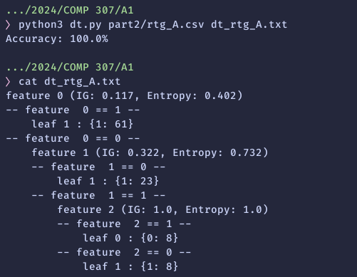

# COMP307 A1: kNN and Decision Trees

This assignment involved two parts.

## Part 1: kNN

The first part involved implementing the k-Nearest Neighbour algorithm. This is a machine learning algorithm, used to perform classification tasks. The algorithm would classify wines into three classes based off of its chemical properties.
The algorithm works by finding the most common class among the $k$ nearest neighbours of a data point. The neighbours are found using the Euclidean distance measure.

## Part 2: Decision Tree

This part involved implement a decision tree algorithm. This is another machine learning algorithm that is used for classification.
It works by constructing a 'decision tree' based on a given set of training data. A decision tree essentially repeatedly splits the dataset over the feature that would result in the most information gain. This is calculated using the information entropy of the splits. The leaf nodes of the tree are the predicted classes. The algorithm essentially takes an instance down through the tree, following a path based off of the feature values of the instance, ending up on the predicted class.

