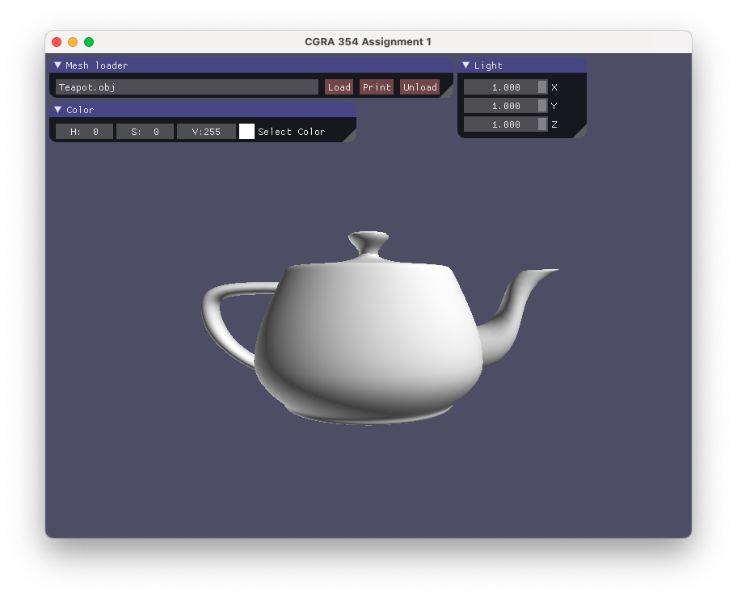
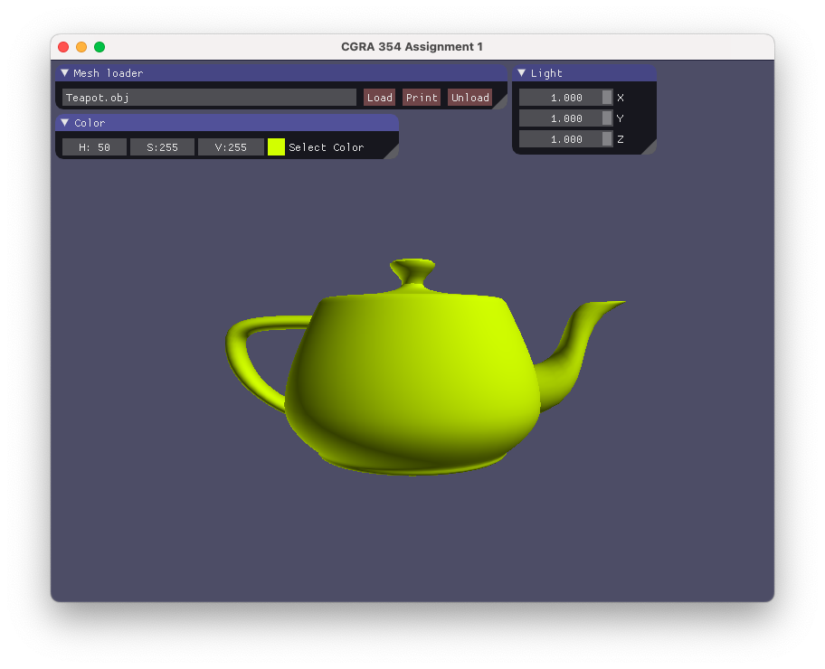
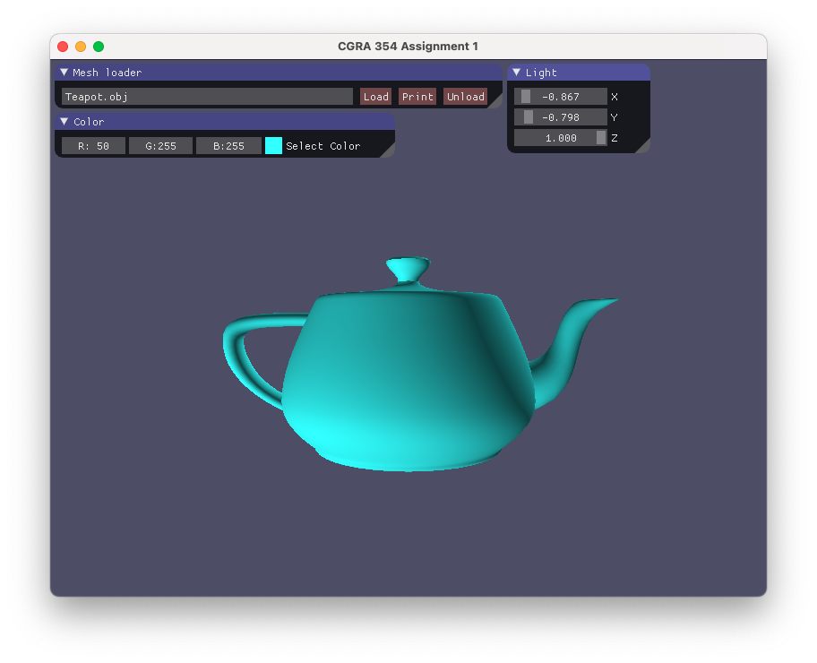

>This project is an assignment for VUW course CGRA 354

# CGRA 354 A1: Geometry and Colour

This was an OpenGL assignment that involved the following:
- Write a model loader for OBJ files
- Implement `build`, `draw`, and `destroy` methods for initialising, drawing, and clearing mesh geometry data buffers
- Add controls to the GUI to allow for the customisation of the model's colour through a shader program
- Add controls to the GUI to allow for the control of a light source's position or direction
- Incorporate the light into the scene with a shader program

