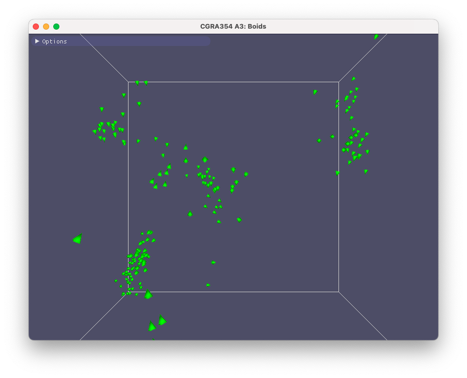
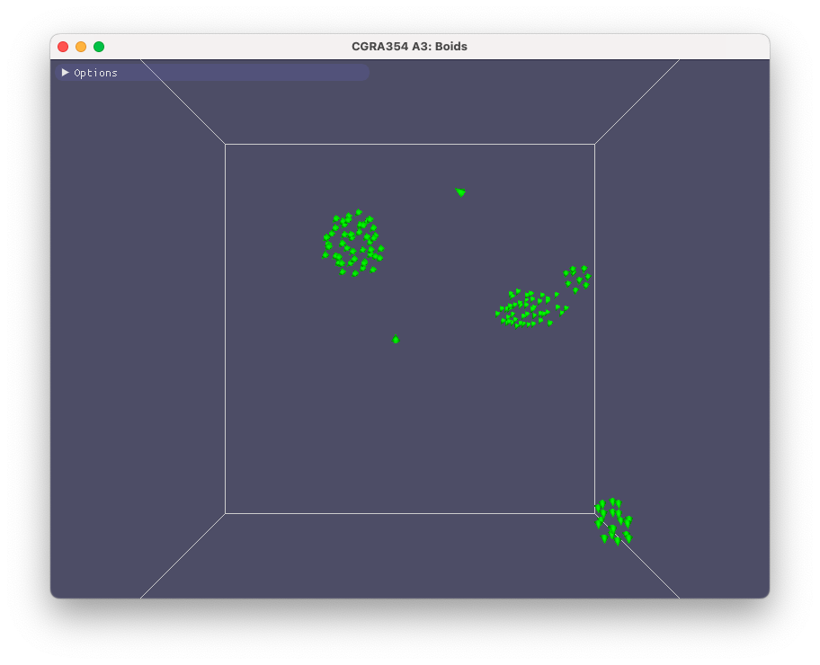
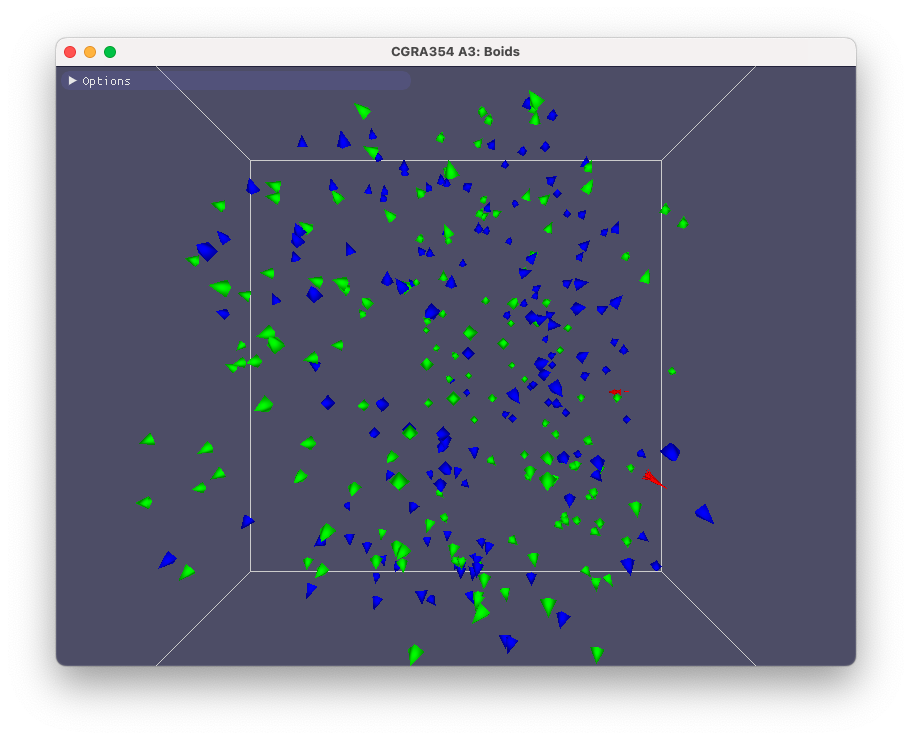
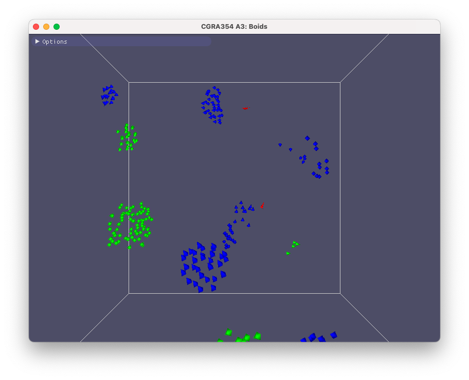

# CGRA354 A3: Flocking Boids

This was an OpenGL assignment which involved the following:
- Implementing the flocking boid algorithm with the behaviours: avoidance, alignment, cohesion, confinement, and sensible speed.
- Allow the strength of the forces to be adjusted at runtime
- Create two flocks of boids that only align and cohere with their flock
- Implement a predator to chase boids, with boids avoiding the predator

