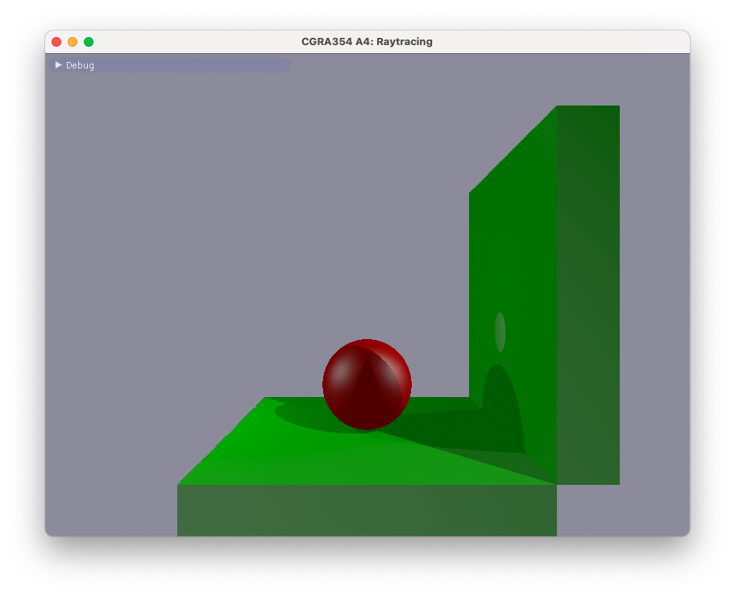
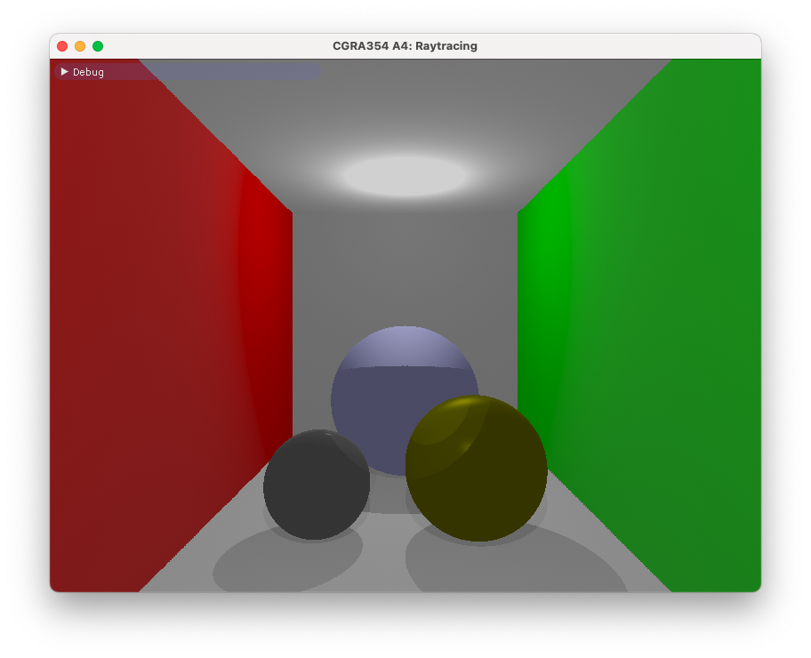

# CGRA354 A4: Raytracing

This was an OpenGL assignment that involved the following:
- Implement a ray tracer. This involved:
    - Implementing functions for determining if a ray intersected with shapes
- Implementing a directional and point light
- Implement occlusion
- Implement the Blinn-Phong shading model

