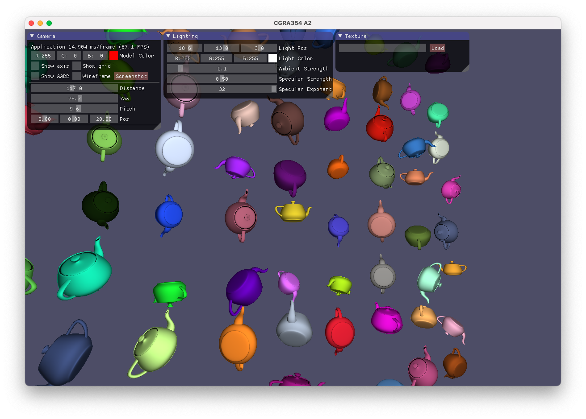

# CGRA 354: Transformations and shading

This was an OpenGL assignment that involved the following:
- Implementing an orbital camera, controllable via keyboard inputs and a GUI interface
- Implementing the Phong shading model with adjustable parameters.
- Implementing instancing to allow for multiple objects of the same mesh to be drawn
- Implementing texture mapping

